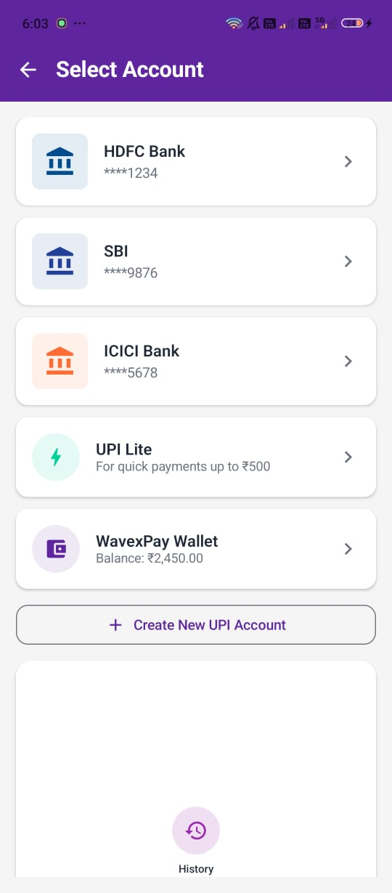
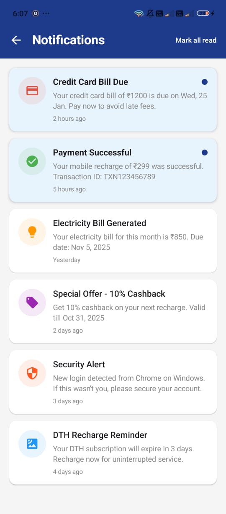
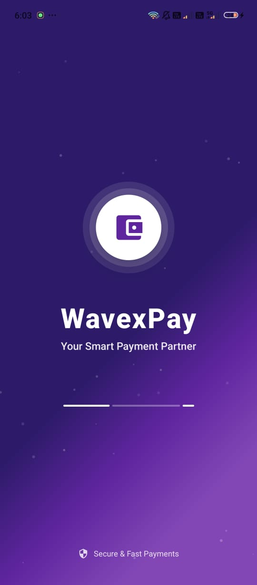
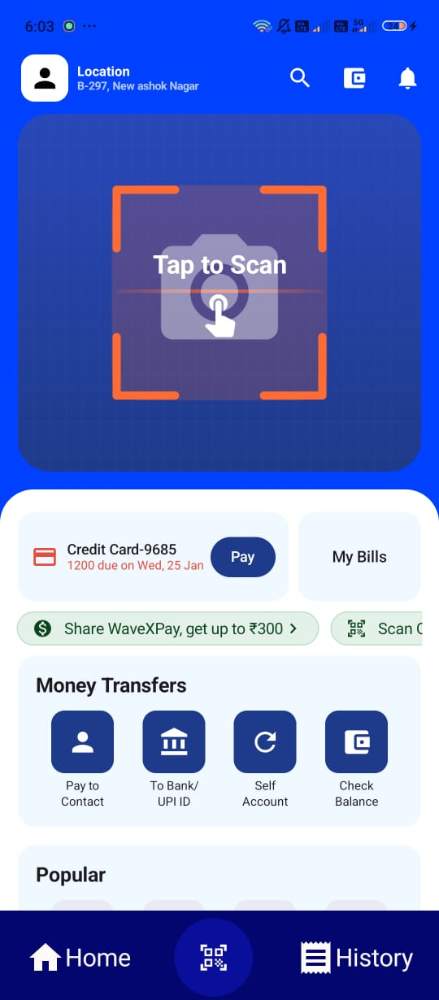
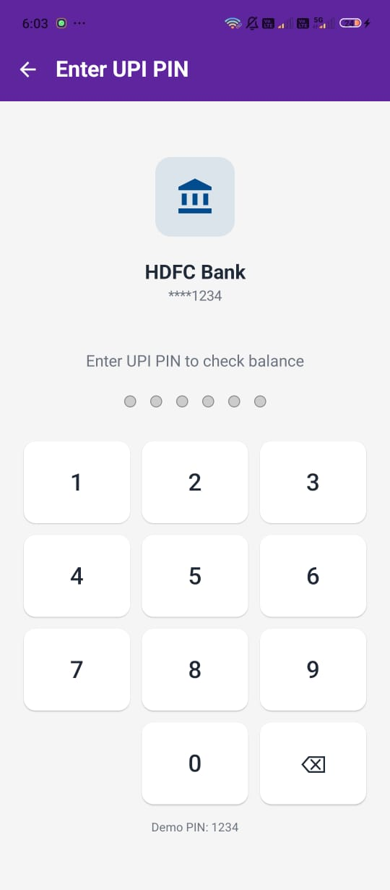
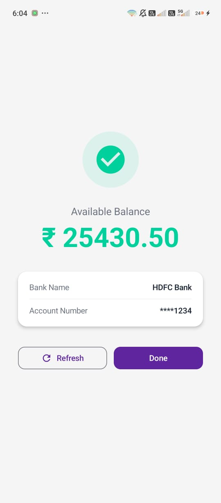
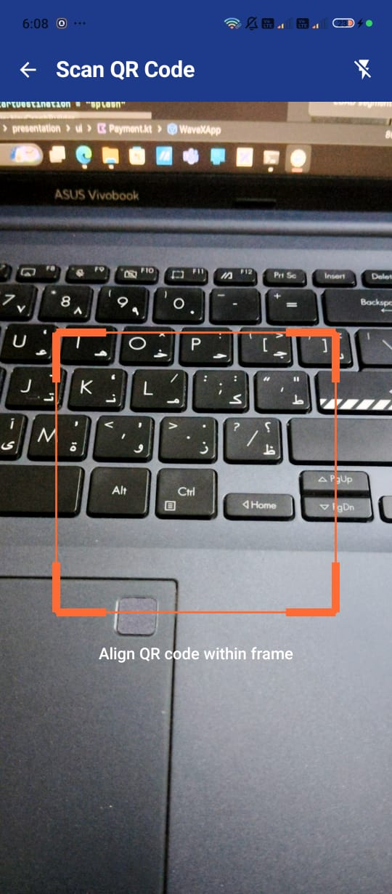
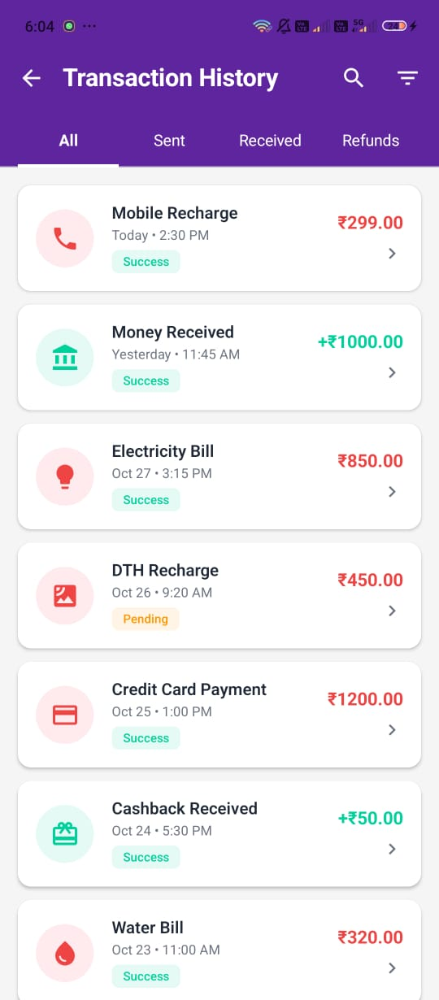

# WavexPay – Modern Payment App UI (Jetpack Compose)

WavexPay is a **Paytm-inspired modern payment app UI** built entirely with **Jetpack Compose**.  
This project focuses purely on the **frontend and UI/UX**, showcasing a smooth, clean, and interactive design for a digital payment experience.

---

##  Download APK

[](https://github.com/vishalkumar/WavexPay/releases/download/v1.0/WavexPay-v1.0.apk)

---

##  App Screenshots
<p align="center">
  
  
  
  
  
  
  
  
  
  
</p>


---

## Features (UI Only)

- **Login & OTP Verification UI**
- **Home Dashboard**
- **Wallet Screen**
- **QR & Profile Sidebar**
- **Transaction History**
- **Send / Receive Money UI**
- **“Coming Soon” Placeholder Screens**
  
---

## Tech Stack

- **Kotlin**
- **Jetpack Compose**
- **Navigation Component**
- **Material 3**
- **Dynamic Theming (Light/Dark Mode Ready)**

---

## Highlights

- 100% **Declarative UI with Jetpack Compose**
- Uses **ModalDrawer** for side navigation
- Clean **MVVM-ready structure** (UI-focused only)
- Built for **scalability** and future backend integration

---

## Future Scope

> This project currently contains only UI logic.  
> Future updates may include:
> - Firebase Authentication & Firestore Integration  
> - Real Transaction Simulation  
> - UPI / Wallet API Integration  
> - AI-powered Spending Insights

---

## Screenshots


---

## Setup Instructions

1. Clone the repository:
   ```bash
   git clone https://github.com/<your-username>/WavexPay.git


